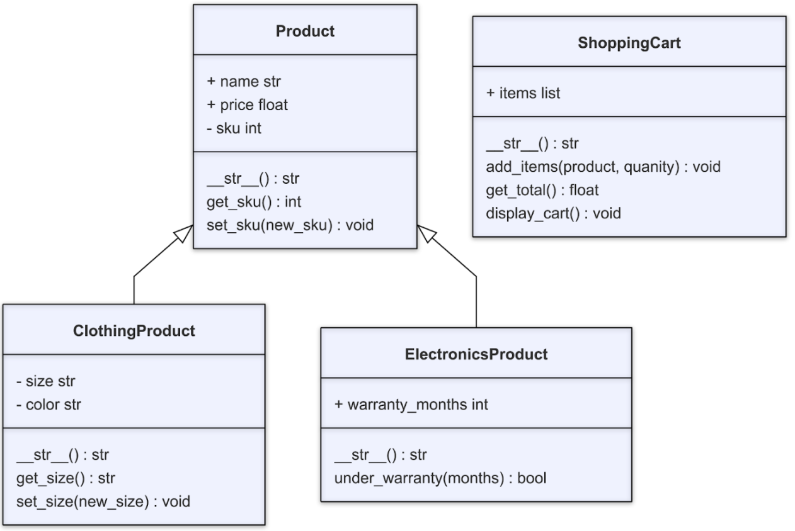

# COMPS III: Unit 4 Code Along

This unit we will be finishing our e-commerce store by implementing polymorphism and encapsulation for the store. In this unit we'll be implementing public and private attributes, creating polymorphic functions, and creating getter and setter methods for some of our private attributes.

## VS Code - app.py has syntax instructions
1. In `ClothingProduct`, change the `clothing_info` method to a `__str__` method.
2. In `ElectronicsProduct`, change the `electronics_info` method to a `__str__` method.
3. Run the tests! `test_clothing_polymorphism` and `test_electronics_polymorphism` should now be passing.

## VS Code - main.py has syntax instructions
4. Create instances of `Product`, `ClothingProduct`, and `ElectronicsProduct`. Log the values using a `print()` statement and show how the `__str__` method is different due to polymorphism.

## VS Code - app.py has syntax instructions
5. In `Product`, change `sku` to be a private attribute.
6. In `ClothingProduct`, change `color` and `size` to be private attributes.
7. Run the tests! `test_cannot_directly_access_sku` and `test_cannot_directly_access_size_and_color` should now be passing.

## VS Code - main.py has syntax instructions
8. Run the code in `main.py` again. Show that it now throws an error since our `__str__` methods are trying to access private attributes. We need getter and setter methods in order to interact with these now.

## VS Code - app.py has syntax instructions
9. In `Product`, do the following:
    - Declare a `get_sku` method that takes the object as an argument and returns the the value contained in `__sku`.
    - Declare a `set_sku` method that takes the object and a `new_sku` as an argument and sets the value of `__sku` to the provided new value.
    - Update the `__str__` method so that anytime you are trying to access `__sku` it now calls `get_sku()` instead.
10. Run the tests. `test_get_sku` and `test_set_sku` should now be passing.
11. In `ElectronicsProduct`, update the `__str__` method so that anytime you are trying to access `__sku` it now calls `get_sku()` instead.
12. In `ClothingProduct`, do the following:
    - Declare a `get_color` method that takes the object as an argument and returns the the value contained in `__color`.
    - Declare a `get_size` method that takes the object as an argument and returns the the value contained in `__size`.
    - Declare a `set_color` method that takes the object and a `new_color` as an argument and sets the value of `__color` to the provided new value.
    - Declare a `set_size` method that takes the object and a `new_size` as an argument and sets the value of `__size` to the provided new value.
    - Update the `__str__` method so that anytime you are trying to access `__sku`, `__size`, and `__color`, it now calls `get_sku()`, `get_size()`, and `get_color()` instead.
13. Run the tests. `test_get_size_and_color`, `test_set_size`, and `test_set_color` should now be passing.

## VS Code - main.py has syntax instructions
14. Run the code in `main.py` again to verify the new outputs.
15. Change the size and color using the new setter methods that were created.